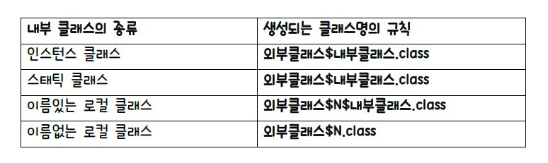

# inner Class

함수를 데이터처럼 처리할 수 있다.

람다식(함수형 프로그래밍)뜨기 전엔 이너클래스를 사용했다.


## innner Class

클래스 안에 클래스 정의하는 것을 말한다

이너 클래스도 이너 멤버 클래스(멤버변수 처럼 선언)와 이너 로컬 클래스(매서드 안에서 선언)가 있다.

또는 스태틱형 이너클러스, 인스턴스 이너클래스라고도 한다.

인스턴스 이너클래스는 아우터 클래스를 선언하고 써야한다.

이름이 없는 로컬 클래스(anonymous class)와 이름이 있는 로컬 클래스가 있다.



즉 $로 생성 되기 때문에 가급적이면 클래스 이름으로 $을 쓰지 말자.

### 선언


이런식으로 a.new B()식으로 선언되어야 한다.

사용될때도 b.멤버로 사용된다.

```java
class X {
	int num;
	void sam(final int i) {
	int total = 20;
	final String s="test";
	class Y {
	멤버들...
	}
	Y y = new Y();
		y.멤버들...;
	}
}
```

Y라는 이너클래스는 X$1$Y식으로 이름 붙어진다. 그게 혼자 선언된거인던지 아닌지 신경 쓰지 않고 무조건 $1을 붙힌다.


### 익명클래스

```java
class N {
	void pr(Test t) {
		...
	}
	void sam() {
		pr(new Test() {
		멤버들...
		});
	..
	}
}
```

- new Test()를 통해 상속했다.